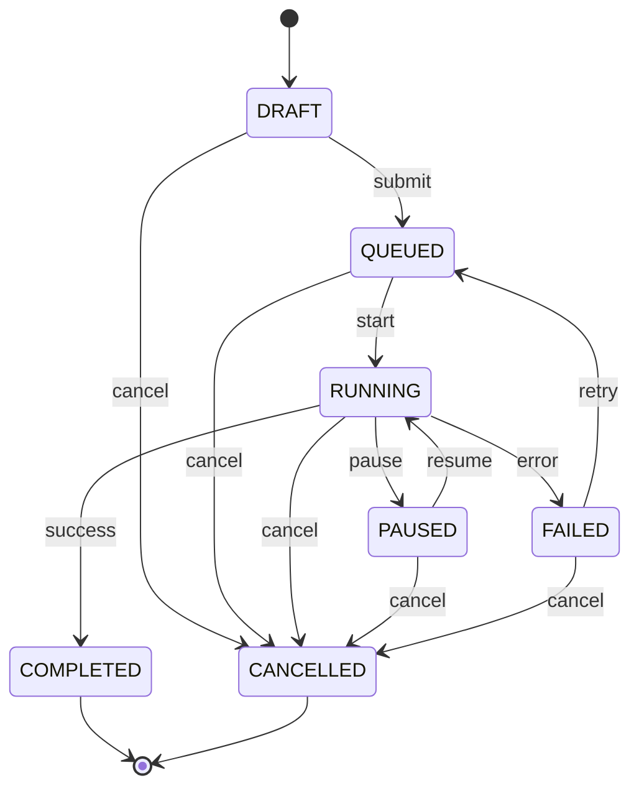

# 模块4：SuperClaw 任务调度系统设计

> 学习人：诸葛亮 | 日期：2026-06-20

---

## 1. 任务调度器架构设计

### 整体架构

```
┌──────────────────────────────────────────────────┐
│                SuperClaw Scheduler                │
├──────────────┬──────────────┬────────────────────┤
│  Trigger     │  Queue       │  Executor          │
│  Layer       │  Layer       │  Layer             │
│  (APScheduler│  (Redis/     │  (Worker Pool)     │
│   定时触发)  │   asyncio)   │  (并发执行)        │
├──────────────┴──────────────┴────────────────────┤
│              Rate Limiter (令牌桶)                 │
├──────────────────────────────────────────────────┤
│              State Manager (状态机)               │
├──────────────────────────────────────────────────┤
│              Retry Handler (指数退避)              │
└──────────────────────────────────────────────────┘
```

### 各层职责

| 层 | 组件 | 职责 |
|---|------|------|
| Trigger | APScheduler | 定时/周期触发任务，支持 cron、interval、date |
| Queue | Redis Queue / asyncio.Queue | 异步任务分发，优先级队列 |
| Executor | Worker Pool + Semaphore | 并发执行 RPA 操作，控制并发数 |
| Rate Limiter | TokenBucket | 多层限流（全局/平台/账号/操作） |
| State Manager | 状态机 | 任务生命周期状态追踪 |
| Retry Handler | 指数退避 | 失败自动重试，降级处理 |

---

## 2. 任务状态机设计

### 状态定义

```
DRAFT → QUEUED → RUNNING → COMPLETED
                   ↓    ↘
                PAUSED  FAILED → (retry) → QUEUED
                   ↓
                CANCELLED
```

### 状态说明

| 状态 | 说明 | 可转换到 |
|------|------|----------|
| DRAFT | 草稿，未提交 | QUEUED, CANCELLED |
| QUEUED | 已提交，等待执行 | RUNNING, CANCELLED |
| RUNNING | 正在执行 | COMPLETED, FAILED, PAUSED, CANCELLED |
| PAUSED | 暂停执行 | RUNNING, CANCELLED |
| COMPLETED | 执行完成 | （终态） |
| FAILED | 执行失败 | QUEUED（重试）, CANCELLED |
| CANCELLED | 已取消 | （终态） |

### Mermaid 状态图



### 状态转换规则

```python
VALID_TRANSITIONS = {
    'DRAFT':     ['QUEUED', 'CANCELLED'],
    'QUEUED':    ['RUNNING', 'CANCELLED'],
    'RUNNING':   ['COMPLETED', 'FAILED', 'PAUSED', 'CANCELLED'],
    'PAUSED':    ['RUNNING', 'CANCELLED'],
    'FAILED':    ['QUEUED', 'CANCELLED'],  # QUEUED = 重试
    'COMPLETED': [],
    'CANCELLED': [],
}
```

---

## 3. 失败重试策略设计

### 指数退避（Exponential Backoff）

```python
def calculate_retry_delay(attempt: int, base_delay: float = 5.0, max_delay: float = 300.0) -> float:
    """
    计算重试等待时间
    
    Args:
        attempt: 当前重试次数（从0开始）
        base_delay: 基础等待秒数
        max_delay: 最大等待秒数
    
    Returns:
        等待秒数
    """
    delay = base_delay * (2 ** attempt)  # 指数增长
    jitter = random.uniform(0, delay * 0.1)  # 10% 随机抖动
    return min(delay + jitter, max_delay)
```

### 重试策略配置

```python
RETRY_STRATEGIES = {
    # 网络超时：重试3次，快速退避
    'network_timeout': {
        'max_retries': 3,
        'base_delay': 5,
        'max_delay': 60,
        'retry_on': ['TimeoutError', 'ConnectionError'],
    },
    # 验证码：不重试，冷却账号
    'captcha': {
        'max_retries': 0,
        'cooldown_minutes': 30,
        'retry_on': ['CaptchaError'],
    },
    # 登录过期：不重试，标记账号
    'login_expired': {
        'max_retries': 0,
        'retry_on': ['LoginExpiredError'],
    },
    # 被限流：重试5次，长退避
    'rate_limited': {
        'max_retries': 5,
        'base_delay': 60,
        'max_delay': 600,
        'retry_on': ['RateLimitError'],
    },
    # 通用错误：重试2次
    'general': {
        'max_retries': 2,
        'base_delay': 10,
        'max_delay': 120,
        'retry_on': ['Exception'],
    },
}
```

### 错误分类与处理

| 错误类型 | 可重试 | 处理方式 |
|----------|--------|----------|
| TimeoutError | ✅ | 指数退避重试 |
| ConnectionError | ✅ | 指数退避重试 |
| CaptchaError | ❌ | 冷却账号30分钟 |
| LoginExpiredError | ❌ | 标记账号需重新登录 |
| RateLimitError | ✅ | 长退避重试（60s起） |
| PermissionError | ❌ | 记录日志，跳过 |
| ValidationError | ❌ | 记录日志，跳过 |

---

## 4. 调度器原型代码

见 `src/rpa/scheduler.py`（已更新）。

---

## 5. 技术选型建议

| 组件 | 当前选择 | 理由 |
|------|----------|------|
| 调度器 | APScheduler | 轻量、单机足够、已有代码基础 |
| 队列 | asyncio.Queue | 单机场景零依赖、够用 |
| 并发控制 | asyncio.Semaphore | 原生支持、灵活 |
| 限流 | 自建 TokenBucket | 完全可控、无外部依赖 |
| 持久化 | SQLAlchemy + SQLite | 已有基础设施 |
| 后续扩展 | Celery + Redis | 多机部署时迁移 |

---

<!-- MODULE_COMPLETE: scheduler_design -->
